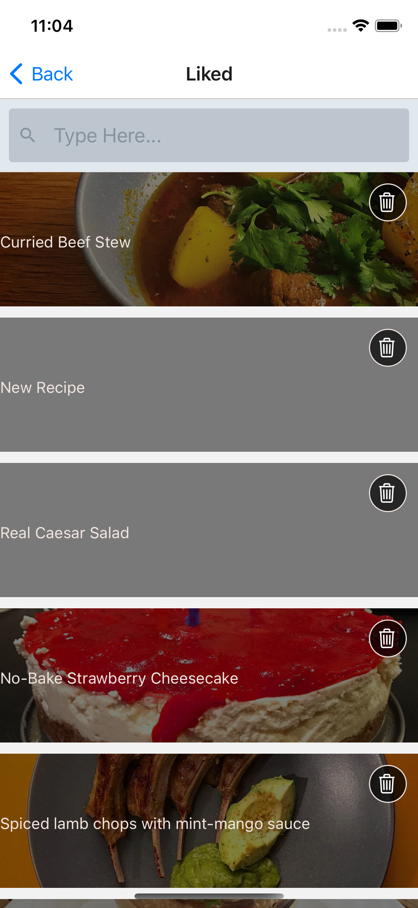

# iOS Recipe App React Native & AWS Backend

A recipe app that can store user favorited items cross-platform and upload recipes on their own. 
The app uses React Native and AWS API and Authentication backend.

[Link to Download Simulation Version]https://recipe-amplify.s3.us-west-1.amazonaws.com/recipe-amplify-version-2.tar

### Feature 1: Liking a recipe
The information is stored in the cloud cross-platform.

  
  

### Feature 2: Search by recipe name and by tag

1. Search will return all the recipes that contain or start with the search keyword
2. Clicking on the tag will search for all the recipes that contain the specific tag name. 

      
    

  
  

### Feature 3: Log in with AWS Cognito userpool and Facebook Federated Sign in Option

  
  
    

# Download and Simulate The Build

[Link to Download]https://recipe-amplify.s3.us-west-1.amazonaws.com/recipe-amplify-version-2.tar

This will download an tar file around 100MB. You need to have IOS simulator installed (comes with XCODE). 

After downloaded, unzip the tar file into an application. Drag and drop the application into your IOS simulator. 

Click on the app and starts saving recipes!

# Features To Be Implemented
1. Uploading images and storage of images using S3. 
2. Better UX flow of creating recipes. 

