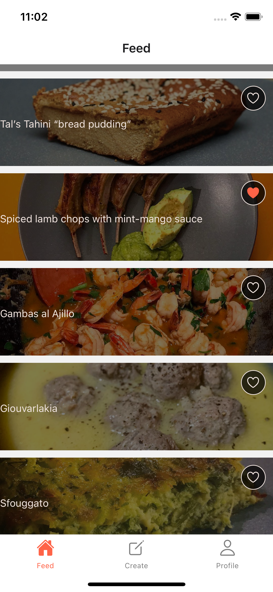
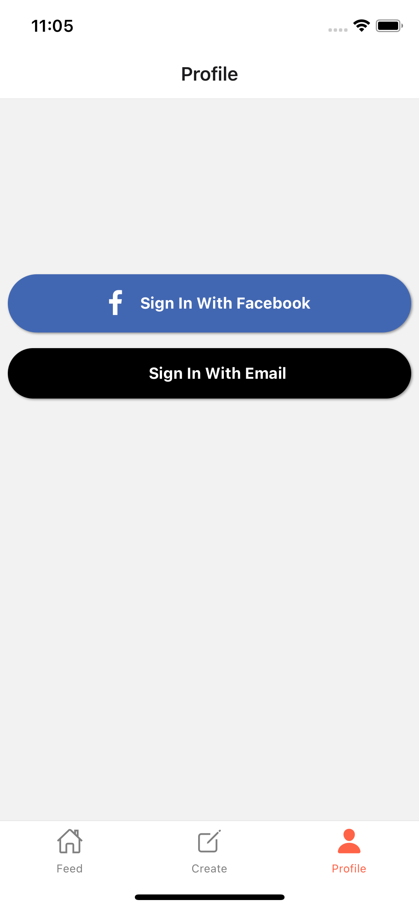

# IOS Recipe App With Ability to Save/Favorite Recipes for Local Storage Built With React Native and AWS Datastore API

  
  
    
  

  
  
  
    

# Download The Build

[Link to Download]https://recipe-amplify.s3.us-west-1.amazonaws.com/recipe-amplify-version-2.tar

This will download an app around 100MB. You need to have IOS simulator installed (comes with XCODE). 

After downloaded, unzip the tar file into an application. Drag the application into your IOS simulator. 

Click on the app and starts saving recipes!

